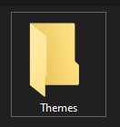
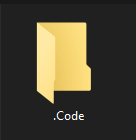
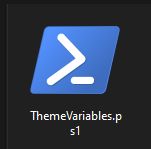
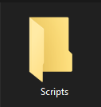
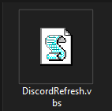
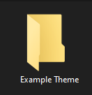
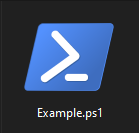

# Theme-Switcher
A Theme Switcher for rainmeter Made by Life_404

* About

This Is basically an App laucher thats Kinda Fancy Because all the magic is in the PowerShell Scripts

# Setup PowerShell Scripts

* `Step 1` Create a folder named Themes somewhere on your computer

  This is where you will keep all your theme changing scripts

    

 * `Step 2` Create a Folder inside the themes folder named .Code

      

    This is where you keep your variables and secondary scripts like discord refresh

 * `Step 3` Create a .ps1 file named ThemeVariables.ps1 in .Code

    This is where you keep your variables and secondary scripts like discord refresh
    
       
     
 * `Step 4` Right click and click edit ThemeVariables.ps1 and paste the following code
     ```powershell
    #-----------------------
    #Variables
    #-----------------------
    
    # BetterDiscord Themes File Path
    $BDThemesFilePath="C:\Users\YOUR_USER\AppData\Roaming\BetterDiscord\data\stable\themes.json"
    # Wallpaper Engine 32 EXE Path
    $WallPaperEnginePath="C:\Program Files (x86)\Steam\steamapps\common\wallpaper_engine\wallpaper32.exe"
    # Rainmeter EXE Path
    $RainmeterPath="C:\Program Files\Rainmeter\Rainmeter.exe"
    ```
    Replace all file paths with your file paths if you don't have wallpaper engine for example just Delete the path
  
  * `Step 5` Create a file in .Code named Scripts (If you don't plan on using BetterDiscord skip this step and step 6)
    
    
  
  * `Step 6` Create a .vbs file named DiscordRefresh.vbs

    This is a script to refresh discord for when you change themes
    
    
    
  * `Step 7` Right click and click edit DiscordRefresh.vbs and paste the following code
     ```powershell
     Set WshShell = WScript.CreateObject("WScript.Shell")
     WshShell.AppActivate "Discord"
     WshShell.SendKeys "{ENTER}"
     WshShell.SendKeys "^r"
     ```  
  * `Step 8` Create a new folder in Themes name it whatever you want 
     
    this will be your first theme
  
    
    
  * `Step 9` Create a .ps1 file named whatever you want
     
    this will be your first themes script

    
    
  * `Step 10` Right click and click edit Example.ps1 and paste the following code
 
     ```powershell
     #Gets Variables
     . $PSScriptRoot\..\.Code\ThemeVariables.ps1
     #Changes Effect in Signalrgb
     Start signalrgb://effect/apply/Rain?bgColor=%23480000"&"color=%23ca000c"&"colorMode=Single%20Color"&"size=20"&"speed=20"&"trails=true"&"-silentlaunch-
     #Changes Wallpaper Engines Wallpaper
     & $WallPaperEnginePath -control openWallpaper -file "C:\Program Files (x86)\Steam\steamapps\workshop\content\000000\0000000000\project.json" 
     #Loads Rainmeter Layout
     & $RainmeterPath !LoadLayout "YOUR_LAYOUT"
     #Changes Discord Theme
     (Get-Content $BDThemesFilePath -Raw) -Replace 'true', 'false' -Replace '"YOUR_THEME": false,', '"YOUR_THME": true,' | Set-Content $BDThemesFilePath
     #Refreshes Discord
     & wscript $PSScriptRoot\..\.Code\Scripts\DiscordRefresh.vbs
     ```  
    Replace all file paths and names and you should be done just link your theme-switcher to the step 10 file (If you don't have wallpaper engine for example remove       the whole line to do with wallpaper engine and you should be good).
    
# FAQ
* The PowerShell Scripts Won't Run
  
  Set your execution policy to remote signed by opening Windows PowerShell and Running 
  
  ```Set-ExecutionPolicy -ExecutionPolicy RemoteSigned```

# Notes
This is my first ever project in rainmeter go easy on me :)
